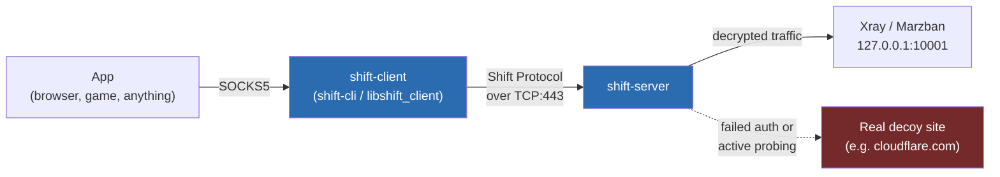

<div align="center">

# Shift / Shift Core

**A Rust network core for DPI evasion: TLS camouflage, adaptive traffic shaping, no static signatures.**

[](.github/workflows/build.yml)
[](LICENSE)
[](Cargo.toml)

[Protocol](docs/PROTOCOL.md) - [Install script](scripts/install.sh) - [License](LICENSE)

</div>

---

## What this is

Shift is a network core written in Rust for evading DPI systems (Russia's TSPU, the GFW, and similar). It is meant to sit in front of Xray or Marzban as a transport layer, not to replace them.



A connection that fails to authenticate (a scanner, active probing, a wrong PSK) gets transparently proxied to a real site instead of being dropped or answered with something suspicious.

## Design points

- **Zero-footprint stealth.** No static handshake signature. A failed auth check or active probe triggers an instant, transparent fallback to a real site.
- **TLS camouflage.** A real, spec-correct TLS 1.3 ClientHello with an honest SNI, followed by fake `application_data` records that look like ordinary post-handshake TLS traffic. See [docs/PROTOCOL.md](docs/PROTOCOL.md#4-tls-camouflage) for why this design was chosen over hand-rolling a full TLS stack.
- **Adaptive Burst Mode.** Web-phase traffic gets randomized padding shaped after real HTTPS packet sizes. Once throughput crosses a threshold (default 64 KB / 250 ms), padding drops to near zero and the connection uses the full MTU.
- **Modern crypto.** X25519 ephemeral keys plus a pre-shared key for forward secrecy, ChaCha20-Poly1305 or AES-256-GCM chosen at runtime based on CPU support, blake3 for key derivation, encrypted frame lengths, replay protection.
- **Zero-allocation I/O.** In-place buffer handling with `bytes::BytesMut`, a multi-threaded `tokio` runtime, `TCP_NODELAY` on every socket.

## Quick start

Build everything:

```bash
cargo build --workspace --release
```

Or install the server with the interactive script (see all options with `--help`):

```bash
sudo ./scripts/install.sh
```

Run the client manually:

```bash
shift-cli --server your.server:443 --server-public-key <hex> \
  --psk "a long shared passphrase" --camouflage-sni www.cloudflare.com \
  --socks-bind 127.0.0.1:1080
```

Point any SOCKS5-aware application at `127.0.0.1:1080`.

## Repository layout

```text
shift-core/
├── crates/
│   ├── shift-proto/     protocol: crypto, frame, handshake, morphing, masquerade, tunnel
│   ├── shift-server/    server daemon: accept loop, decoy fallback, forwarder
│   └── shift-client/    SOCKS5 client, C-FFI for GUI/mobile apps, CLI
├── docs/                 protocol specification
├── scripts/install.sh    interactive server installer
└── .github/workflows/    CI: fmt, clippy, test, cross-compile, packaged artifact
```

## Testing

```bash
cargo test --workspace
```

`crates/shift-server/tests/integration.rs` spins up an echo server, a `shift-server`, and a `shift-client` in one process, and relays real traffic through the full SOCKS5 to Shift tunnel to forward path, including the TLS camouflage mode and the decoy fallback for a wrong PSK.

## CI/CD

`.github/workflows/build.yml` runs fmt, clippy with `-D warnings`, and the test suite, then cross-compiles release binaries for `x86_64-unknown-linux-gnu`, `aarch64-unknown-linux-gnu`, and `x86_64-pc-windows-gnu`, and bundles all three into one `shift-core-all-platforms.zip`. Pushing a `v*` tag publishes that archive as a GitHub Release, which `scripts/install.sh` downloads from by default.

## License

[MIT](LICENSE)
