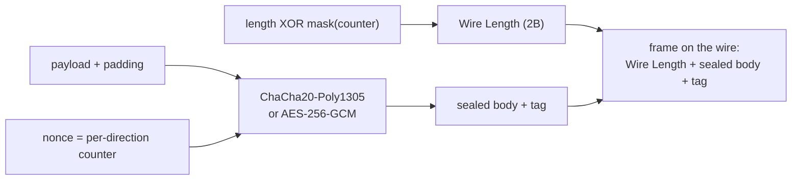
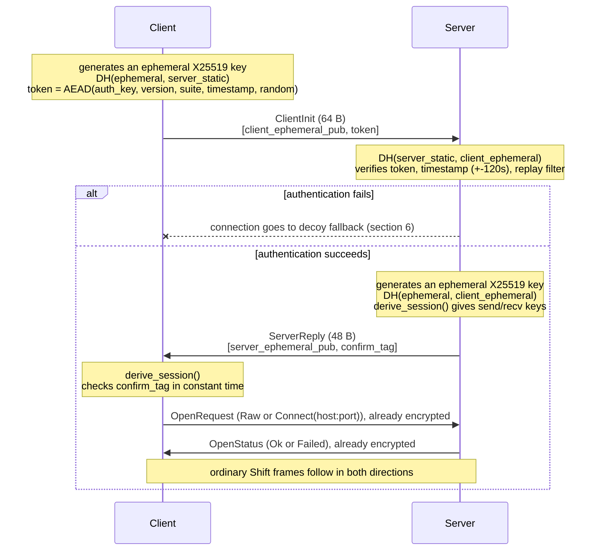
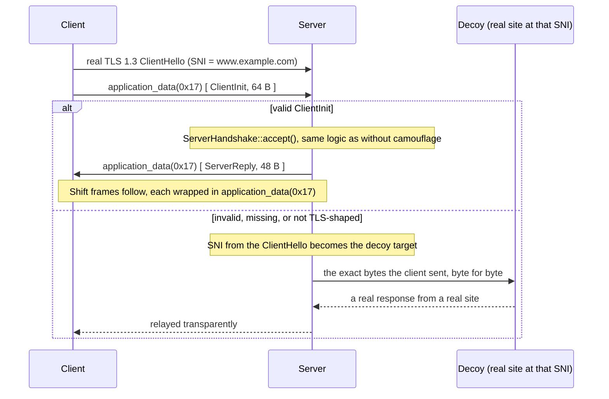
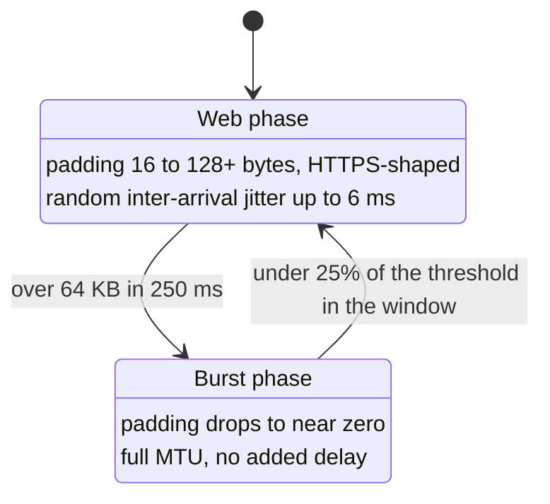

# The Shift Protocol

This document describes the behavior implemented in `crates/shift-proto`. If it ever disagrees with the code, the code wins.

## Contents

- [1. Threat model](#1-threat-model)
- [2. Frame format](#2-frame-format)
- [3. Handshake](#3-handshake)
- [4. TLS camouflage](#4-tls-camouflage)
- [5. Adaptive Burst Mode](#5-adaptive-burst-mode)
- [6. Decoy fallback](#6-decoy-fallback)
- [7. Cryptographic stack](#7-cryptographic-stack)

---

## 1. Threat model

Modern DPI systems have moved from static signature matching to statistical analysis. Shift targets four specific techniques:

| DPI technique | Shift's countermeasure |
|---|---|
| Flow/behavioral analysis (one long-lived tunnel per IP) | Short-lived connections instead of one persistent tunnel |
| Entropy detection (uniform, metadata-free encrypted noise) | TLS camouflage: the outer shape is a real, structurally honest TLS 1.3 connection |
| CDF/IAT analysis of the first packets | Adaptive Burst Mode: padding shaped after real HTTPS packet size distributions |
| Active probing (verification requests against suspicious IPs) | Decoy fallback: any unauthenticated request gets a real response from a real site |

## 2. Frame format

Every frame after the handshake is an AEAD-sealed block with an encrypted length field:

```text
+-------------------+----------------------------------------------+-------------+
|  Wire Length (2B)  |               Sealed Body (N B)               |  AEAD Tag   |
|                    +-----------+-----------+------------+----------+   (16 B)    |
|                    | Payload   | Padding   | Payload    | Padding  |             |
|                    | Len (2B)  | Len (2B)  | Data       | (zeros)  |             |
+-------------------+-----------+-----------+------------+----------+-------------+
| length XOR mask    |           encrypted and authenticated          | Poly1305 or |
| (per-frame, not     |     (ChaCha20-Poly1305 or AES-256-GCM)         | GHASH tag   |
| visible on its own) |                                                |             |
+-------------------+----------------------------------------------+-------------+
```

Key properties:

- **The frame length is not visible on the wire.** `Wire Length` is the real body length XORed with `mask(ctr) = blake3_keyed(length_key, ctr)[0:2]`, a different mask for every frame.
- **The nonce is an implicit per-direction counter.** Zero bytes on the wire, with automatic key rotation every 2^20 frames.
- **Padding lives inside the AEAD boundary**, not outside it: it is filled with real ciphertext (encrypted zeros), so it is not statistically distinguishable from payload.
- Empty frames (`payload_len == 0`, padding only) are silently dropped by the decoder. They serve as cover traffic.



## 3. Handshake

Ephemeral X25519, the server's static key, and a pre-shared key together give forward secrecy, mutual authentication, and replay protection.



- **Forward secrecy**: both ephemeral keys feed `derive_session()` through blake3. A later compromise of the PSK or the server's static key does not decrypt captured traffic.
- **Mutual authentication**: the server proves itself with `confirm_tag`, computed over the handshake transcript with a key derived from the shared secret. It cannot be forged without the PSK.
- **Replay protection**: the server keeps a `ReplayFilter` (client ephemeral key to expiry), so replaying the same `ClientInit` is rejected.
- **Direction keys are separate**: client-to-server and server-to-client traffic use different keys and different nonce counters.

## 4. TLS camouflage

An optional outer layer (`--camouflage` on the server, `--camouflage-sni` on the client). Rather than emulating a full TLS 1.3 state machine (a real risk of subtle, detectable deviations from a genuine implementation), Shift sends one real ClientHello and then carries its own handshake as ordinary `application_data` records. That is exactly what post-handshake TLS 1.3 traffic looks like from the outside.



Notes:

- The server never sends a real `ServerHello`, `Certificate`, or `Finished`. A legitimate client does not expect them, since it already authenticated through the Shift handshake.
- Anyone who connects to the server with the same SNI gets the same real response from the real site, so there is nothing for the server to behave differently about for that specific probe.
- The `session_id` and `key_share` fields in the ClientHello are filled with random bytes and never used for a real ECDHE exchange. They exist purely for shape, not as a second authentication channel.

## 5. Adaptive Burst Mode

A two-phase traffic shaper driven by a sliding window (5 slots, 250 ms by default):



Frame sizes in the web phase are not drawn from a uniform distribution. They come from `SizeProfile`, a set of weighted buckets approximating real HTTPS packet size distributions.

## 6. Decoy fallback

Any failure during authentication (wrong PSK, replay, a stale timestamp, non-TLS-shaped bytes, a timeout) leads to a byte-perfect proxy to a decoy target:

- The server buffers every byte it receives from the client, whether or not it can be parsed.
- On failure, those exact bytes are replayed to the decoy server first, and the connection then becomes an ordinary bidirectional proxy.
- With TLS camouflage on, the decoy target is the SNI the probe itself sent (dialed on `--camouflage-port`, 443 by default), not the generic `--fallback` address, so the server's behavior toward a given probe matches what a direct connection to that SNI would look like.

## 7. Cryptographic stack

| Purpose | Algorithm |
|---|---|
| AEAD | ChaCha20-Poly1305 or AES-256-GCM, chosen at runtime by CPU support for AES-NI/PCLMULQDQ |
| KDF / hashing | blake3 (`derive_key`, `keyed_hash`) |
| Key exchange | X25519 (`x25519-dalek`), with low-order point rejection |
| Randomness | `OsRng` for handshake material, `fastrand` for non-secret padding and timing jitter |
